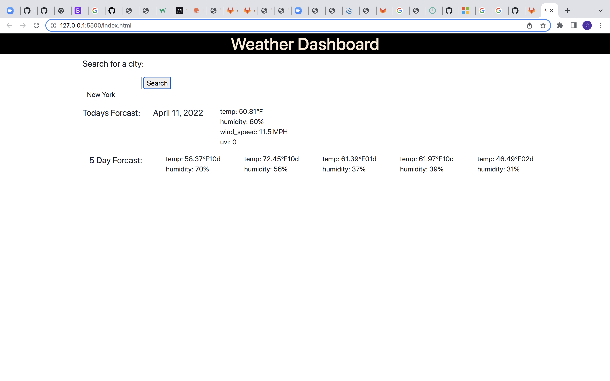

# weather-dashboard

# Description

### In this project I coded out a weather dashboard. This project allows you to see the current temperature and a 5 day forcast with whatever location you choose. All you have to do is click on the search icon and type whatever location you want and the results will appear below.

# Usage

### 

### The screenshot shows you what the deployed site looks like. As stated above, the current temperature and a 5 day forcast will appear below with whatever location you chose.

# Features

### This project uses HTML, CSS, JavaScript, jQuery, and uses OpenWeatherMap ipa to gather all of the weather data.

# Link

### https://callanhunter.github.io/weather-dashboard/
